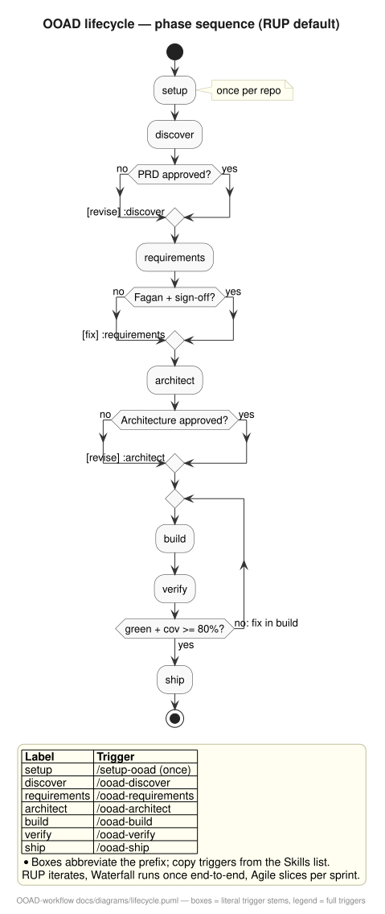

# OOAD Workflow — Professional Agentic Framework

Agentic framework **OOAD + Clean 4 Layers + TDD**, aligned with the Systems Analysis paradigm (`IEEE830/Use Cases → UML/GoF → TDD → MVC/Layers`). Professional alternative to `mattpocock/skills` (DDD/VSA) and `addyosmani/agent-skills` (PRD→VSA SaaS).



*Source:* `docs/diagrams/lifecycle.puml` — boxes use literal trigger stems (`setup` = `/setup-ooad`, `discover` = `/ooad-discover`, etc.). Regenerate with `plantuml -tsvg docs/diagrams/lifecycle.puml`.

## Methodology Profiles (selectable via `setup-ooad`)

| Profile | When | Required Artifact |
|---------|------|-------------------|
| **Iterative RUP** *(default)* | Medium product, small-to-medium team, evolving requirements with risk | Vision + detailed UCs + C4/UML + iterative ADR |
| **Waterfall** | Fixed contract, regulation, large team | Signed SRS IEEE830 + heavy SDD |
| **Agile / Scrum** | Digital product, changing requirements | US backlog INVEST + Gherkin AC + just-enough ADR |

## Skills (all `disable-model-invocation: true`, human calls `/name`)

```text
/ask-ooad (router — run when unsure which fits)
  ↓
/setup-ooad (once per repo — run FIRST: bootstraps RUP/Waterfall/Agile + tracker + layout)
  ↓
/ooad-discover (PRD + Vision)
  ↓
/ooad-requirements (SRS/UC/US + RTM)
  ↓
/ooad-architect (C4/UML + ADR)
  ↓
/ooad-build ↔ /ooad-verify (loop per UC/US until green: suite green, cov ≥80%, no blockers)
  ↓
/ooad-ship (release)
```

RUP iterates, Waterfall runs once end-to-end, Agile slices per sprint. Brownfield may start at `ooad-architect` with gap → US.

| # | Trigger | Does | Produces | Run |
|---|---------|------|----------|-----|
| – | `/ask-ooad` | Router over the 7 workflow skills | decision | once per decision |
| 0 | `/setup-ooad` | RUP/Waterfall/Agile + tracker + 4-layer layout | bootstrapped repo | once per repo |
| 1 | `/ooad-discover` | RUP Inception + Vision + MoSCoW | PRD + draft glossary | per feature |
| 2 | `/ooad-requirements` | IEEE 29148 + UC/INVEST/Gherkin + RDD/CRC + Fagan + RTM | SRS/UC/US + CRC + RTM | per feature |
| 3 | `/ooad-architect` | C4 + UML + RDD→GRASP + GoF + Clean 4 Layers + ADR-MADR | C4/UML + classes + ADR | per feature |
| 4 | `/ooad-build` | Clean 4 Layers + GRASP-guarded TDD (Beck) + OpenAPI, slice by UC/US | TDD vertical slice | per UC/US |
| 5 | `/ooad-verify` | BDD/Gherkin + Test Pyramid 80/15/5, RTM-traced | Gherkin test plan | per slice |
| 6 | `/ooad-ship` | Continuous Delivery + SRE | checklist + rollback + changelog | per release |

Release history: [`CHANGELOG.md`](CHANGELOG.md). Shared vocabulary in `references/ooad-vocabulary.md` — no synonym drift.

## Installation

```bash
npx skills@latest add estebanmatias92/ooad-workflow
```

Then run `/setup-ooad` once per repo — it bootstraps the methodology profile, issue tracker and layout before the workflow starts.

```bash
npx skills@latest update
```

## Structure

`skills/` (8 skills) · `templates/` (PRD, SRS-830, UC, US-Gherkin, C4/UML, ADR-MADR…) · `references/` (artifacts matrix, definition of done, vocabulary) · `docs/` (glossary, comparisons, diagrams). Details: [`AGENTS.md`](AGENTS.md).

## Comparison

> **Which cycle to follow?** Side-by-side activity diagram, outputs/state, profile variants and decision table: [`docs/dev-cycle-comparison.md`](docs/dev-cycle-comparison.md).

## References

- `docs/glossary.md` — acronym & term index (human entry point)
- `references/ooad-vocabulary.md` — single source for leading words
- `docs/systems-analysis-ooad-paradigm.md` (ES)

## Contributing

Want to collaborate? See [`AGENTS.md`](AGENTS.md).

## License

MIT — see `LICENSE`.
