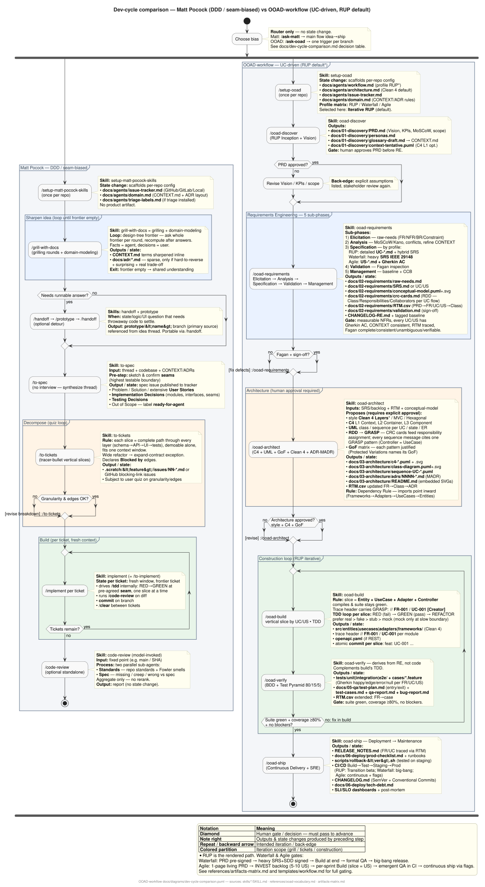

# Dev-cycle comparison — Matt Pocock (DDD / seam-biased) vs OOAD-workflow (UC-driven)

> **Purpose:** a single place to see where this pack comes from, what existed before,
> and how to choose a bias. Visual is the activity diagram below; the text is the argument.

*Source:* `docs/diagrams/dev-cycle-comparison.puml` — regenerate with `plantuml -tsvg docs/diagrams/dev-cycle-comparison.puml`.

---

## 1. Origin & why two cycles exist

**What existed before.** The `mattpocock/skills` pack (installed at `~/.agents/skills/` — `setup-matt-pocock-skills`, `grill-with-docs`, `to-spec`, `to-tickets`, `implement`, `code-review`, plus `ask-matt` router) is **DDD / seam-biased**. It was designed for small product teams that treat a spec as a list of user stories and treat testing as seam selection (the highest testable boundary). Its lineage is Evans (DDD) → deep modules → tracer-bullet slices; requirements are lightweight by design.

**Why this pack.** The Tecnicatura en Análisis de Sistemas (Res. 6790/19 — `docs/systems-analysis-ooad-paradigm.md:3`) evaluates a **different lineage**: `IEEE 830/29148 / Use Cases → UML / GoF → TDD → MVC/Layers`. Students are graded on FR/NFR traceability, detailed UC flows, sequence-to-class derivations, justified GoF, and Clean 4-layer dependency rule. Forcing a DDD/seam vocabulary onto that curriculum causes the confusion documented in `docs/systems-analysis-ooad-paradigm.md:70` — aggregates, event sourcing, and VSA do not map to the program's relational + MVC core.

`ooad-workflow` is therefore a **professional alternative**, not a fork: same idea→ship ambition, different method bias, so either can be chosen per repo without mixing vocabularies (`references/ooad-vocabulary.md` is the single source for OOAD leading words).

## 2. How to read the diagram

* **Swimlanes:** left = Matt Pocock, right = OOAD (RUP default — see §4 for Waterfall/Agile variants).
* **Diamonds:** human gates — nothing advances without an explicit decision (PRD approval, Fagan sign-off + baseline, architecture approval of style + C4 + GoF, frontier-empty, ticket granularity quiz). The diagram distinguishes intended iteration from accidental rework.
* **`note right`:** outputs and state changes produced by the preceding step — per your ask, comments sit beside the step rather than inside it.
* **Colored partitions:** iteration scopes (grill rounds, tickets quiz, construction loop). Backward arrows = back-edges (e.g. `ooad-verify → ooad-build` on failure).
* **Shared START:** `Choose bias` — `ask-matt` vs `ask-ooad` — router only, no state change. Either branch is self-contained after that diamond.

Regeneration is the same as every other `*.puml` in the pack (`ooad-requirements`, `ooad-architect` verify steps): `plantuml -tsvg`.

## 3. Step-by-step — flow, iterations, outputs/state

### Matt Pocock (left lane)

| Step | Flow & iterations | Outputs / state change |
| ------ | ------------------- | ------------------------ |
| `setup-matt-pocock-skills` (once) | Linear, once per repo | `docs/agents/issue-tracker.md` + `domain.md` (+ `triage-labels.md`). No product artifact. |
| `grill-with-docs` | **Loop:** design-tree frontier — ask whole frontier per round, recompute after answers. Facts = agent, decisions = user. Exit when frontier empty. | `CONTEXT.md` terms sharpened inline + sparse `docs/adr/*.md` (only if hard-to-reverse + surprising + real trade-off). |
| `prototype` detour | **Branch** — only if a question needs runnable answer (state, logic, UI). `/handoff` out → `prototype` → `/handoff` back. | `prototype/<name>` branch (throwaway, kept as primary source). |
| `to-spec` | Single synthesis — **no interview**, synthesizes thread + codebase + CONTEXT/ADRs. Pre-step: sketch & confirm seams. | Spec issue on tracker (`Problem / Solution / extensive User Stories / Implementation Decisions including seams & modules / Testing Decisions / Out of Scope`) — label `ready-for-agent`. |
| `to-tickets` | **Quiz loop:** draft tracer-bullet slices + `Blocked by` edges → user reviews granularity/edges → revise until approved. | `.scratch/<feature>/issues/NN-*.md` or GitHub blocking-link issues — each with `Blocked by`. Wide refactors use expand–contract. |
| `implement` per ticket | **Outer repeat:** one fresh context per ticket, `clear` between tickets, work blockers-first. **Inner loop:** `tdd` RED→GREEN at pre-agreed seam, one slice at a time. Closes with `code-review`, then commit. | Per ticket: code at seam + tests + diff-reviewed commit on branch. Context disposed after ticket. |
| `code-review` (standalone or as `implement`'s close) | Single diff vs fixed point (`git diff <point>...HEAD`), two parallel sub-agents (Standards vs Spec), aggregate only. | Report — no state change. |

### OOAD-workflow, RUP default (right lane)

| Step | Flow & iterations | Outputs / state change |
| ------ | ------------------- | ------------------------ |
| `setup-ooad` (once) | Linear, once per repo | `docs/agents/workflow.md` (profile = RUP) + `architecture.md` (Clean 4) + `issue-tracker.md` + `domain.md`. |
| `ooad-discover` (RUP Inception) | Linear → **gate: human approves PRD**. Back-edge revises Vision/KPIs/scope. | `docs/01-discovery/PRD.md` (Vision + KPIs + MoSCoW + scope/assumptions) + `personas.md` + `glossary-draft.md → CONTEXT.md` + tentative `context-tentative.puml` (C4 L1 optional). |
| `ooad-requirements` (5 sub-phases) | **Sequential inside the skill:** Elicitation → Analysis/Negotiation (MoSCoW/Kano) → Specification (by profile) → Validation (Fagan) → Management (baseline + RTM). Back-edge on Fagan failure. | `raw-needs.md` (FR/NFR/BR/Constraint IDs) + `SRS.md` or `use-cases/UC-*.md` / `backlog/US-*.md+Gherkin` + `conceptual-model.puml`+.svg + `RTM.csv` (PRD→FR/UC/US→Class) + `validation.md` (sign-off) + `CHANGELOG-RE.md` + tagged baseline. Gate: measurable NFRs, every UC/US has Gherkin AC, no Fagan defects. |
| `ooad-architect` | Linear → **gate: explicit approval of style + C4 + GoF**. Back-edge revises design. | `c4-context/container.puml`+.svg + `class-diagram.puml`+.svg + `sequence-UC-*.puml` + `data-model-er.puml` + `adrs/NNNN-*.md` (MADR) + `README.md` with embedded SVGs + `RTM.csv` updated `FR→Class→ADR`. Rule: Dependency Rule imports inward. |
| `ooad-build` | **Part of construction repeat** — vertical slice by UC/US (`Entity + UseCase + Adapter + Controller`) compiles & suite green. | `src/entities/` + `src/usecases/` + `src/adapters/` + `src/frameworks/` + trace header `// FR-001 / UC-001` + `openapi.yaml` + atomic commit `feat: UC-001 ...`. |
| `ooad-verify` | **Part of same repeat** — derives `*.feature` (happy/edge/error/null) from RE (not code), pyramid 80/15/5. **Back-edge:** failure → `ooad-build`. | `tests/unit/` + `tests/integration/` + `tests/e2e/` + `cases/*.feature` + `docs/05-qa/test-plan.md` + `test-cases.md` + `qa-report.md` + `bug-report.md` + `RTM.csv` extended `FR→case`. Gate: suite green, cov ≥80%, no blockers. |
| `ooad-ship` | Linear (RUP Transition). Pipeline `Build→Test→Staging→Prod`. | `RELEASE_NOTES.md` (FR/UC via RTM) + `prod-checklist.md` + runbooks + `rollback-<ver>.sh` (tested on staging) + workflow file + `CHANGELOG.md` (SemVer) + `tech-debt.md` + SLI/SLO dashboards. |

**Key structural difference:** Matt iterates around **conversation → seams → tickets** (idea stays conversational until `to-spec` collapses it); OOAD iterates around **baselined documents → gates → Construction increments** (each phase leaves a reviewed, RTM-traced artifact before the next begins).

## 4. Profile variants (why the diagram shows RUP only)

`references/artifacts-matrix.md` and `templates/workflow.md` govern all three profiles over the same 7-phase SDLC (`artefactos-por-fase-y-metodologia.md:72`). Rendering all three as parallel lanes makes the diagram unreadable, so RUP is the drawn path and the others are gates in the legend:

* **Waterfall (Royce):** PRD pre-signed → heavy `SRS IEEE 29148` + contractual SDD signed (legal gate) → Build at end → formal QA (complete test plan upfront) → big-bang release. Use when contract/regulation fixes scope upfront.
* **Agile / Scrum (Schwaber/Sutherland/Beck):** 1-page living PRD → `INVEST` `US-*.md` + `Gherkin` AC per sprint → per-sprint Build (slice = US) → emergent QA automated in CI → continuous ship via flags. Use when requirements change sprint-to-sprint.
* **RUP (Jacobson/Kruchten — default, drawn):** Vision revised at Elaboration, hybrid UC+SRS, executable architectural baseline at Elaboration, iterative Construction per UC, QA per iteration, Transition beta → prod. Fits medium product, small-to-medium team, evolving requirements with risk.

## 5. Which bias to choose

| If… | Follow | Reason |
| ----- | -------- | -------- |
| Curriculum or contract requires `IEEE 29148` FR/NFR, detailed UCs, UC→sequence→class derivation, or signed RTM | **OOAD** (RUP or Waterfall) | Native artifacts; graded/contractual obligation. |
| Contract or regulation fixes full scope upfront | **OOAD Waterfall** | Signed SRS/SDD gates, big-bang release. |
| Medium product, small-to-medium team, evolving requirements with risk | **OOAD RUP (default)** | Vision→UCs→C4/ADR baseline → iterative increments with per-iteration RTM. |
| Digital product, changing requirements, continuous delivery with flags | **OOAD Agile** | Living PRD + INVEST + Gherkin + just-enough ADR. |
| Exploratory product/side-project, no formal RE, prefer seam/deep-module vocabulary | **Matt Pocock** | Lightweight: conversation → spec → tracer-bullet tickets → seams. |
| Starting with bugs/requests piling up or a large foggy effort | Either — but use **`triage`/`wayfinder`** (Matt pack) as on-ramps before either `grill-with-docs` | Those on-ramps produce map/triaged issues that feed `to-spec`. |

Skills from both packs are `disable-model-invocation: true` — the human picks the router (`ask-matt` vs `ask-ooad`). Do not mix vocabularies mid-repo (DDD's aggregates/events vs OOAD's GoF/Clean 4).

## 6. Skill-name mapping (names you listed → actual IDs)

| You wrote | Actual skill ID | Installed at |
| ----------- | ----------------- | -------------- |
| `/setup-matt-pocock-skills` | `setup-matt-pocock-skills` | `~/.agents/skills/setup-matt-pocock-skills/SKILL.md` |
| `/grill-with-docs` | `grill-with-docs` (= `grilling` + `domain-modeling`) | `~/.agents/skills/grill-with-docs/SKILL.md` |
| `/to-spec` | `to-spec` | `~/.agents/skills/to-spec/SKILL.md` |
| `/to-ticket` | **`to-tickets`** | `~/.agents/skills/to-tickets/SKILL.md` |
| `/to-implement` | **`implement`** | `~/.agents/skills/implement/SKILL.md` |
| `/code-review` | `code-review` | `~/.agents/skills/code-review/SKILL.md` |
| `ask-*` routers | `ask-matt` vs `ask-ooad` | `~/.agents/skills/ask-matt/SKILL.md` vs `skills/ask-ooad/SKILL.md` |

## 7. Maintenance

* Update this doc when either pack changes its flow (new skill, new gate, vocabulary drift).
* Re-render the diagram after editing the `.puml`: `plantuml -tsvg docs/diagrams/dev-cycle-comparison.puml` and commit both files.
* Cross-references checked: `references/artifacts-matrix.md`, `references/ooad-vocabulary.md`, `references/definition-of-done.md`, `templates/workflow.md`, `docs/systems-analysis-ooad-paradigm.md`.

---

*See also:* `docs/glossary.md` (acronym/term index) · `README.md:Comparison` · `references/artifacts-matrix.md` · `references/ooad-vocabulary.md` (single source) · `templates/workflow.md` · `docs/systems-analysis-ooad-paradigm.md`.
